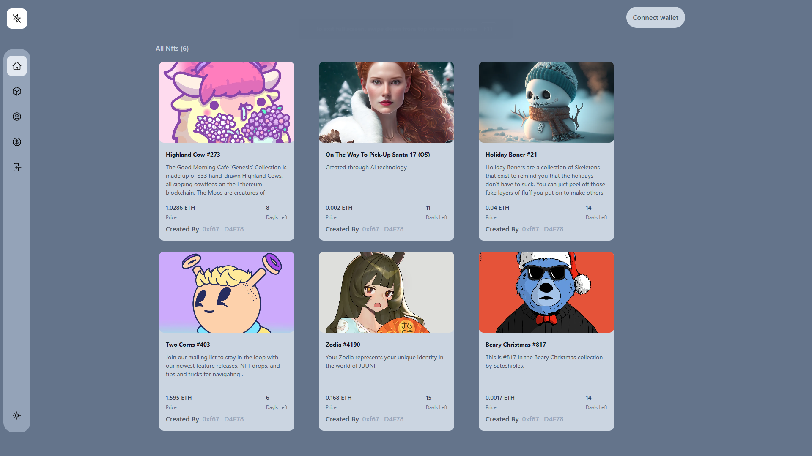

## About Project

A web 3.0 projct for creating nfts and displaying it using Thirdweb, ReactJS and Solidity Technologies.


### Deploy the somart contract

1. enter blockchain folder

```bash
cd blockchain
```

2. Deploy the contract

```bash
npm run deploy
```

### Running the front end

1. enter client folder

```bash
cd client
```

2. running in web browser

```bash
npm run dev
```

### Enjoy exploring the project!
